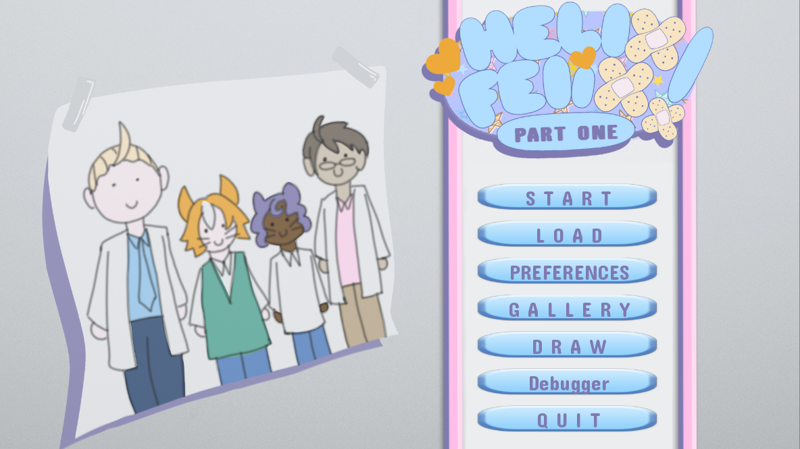
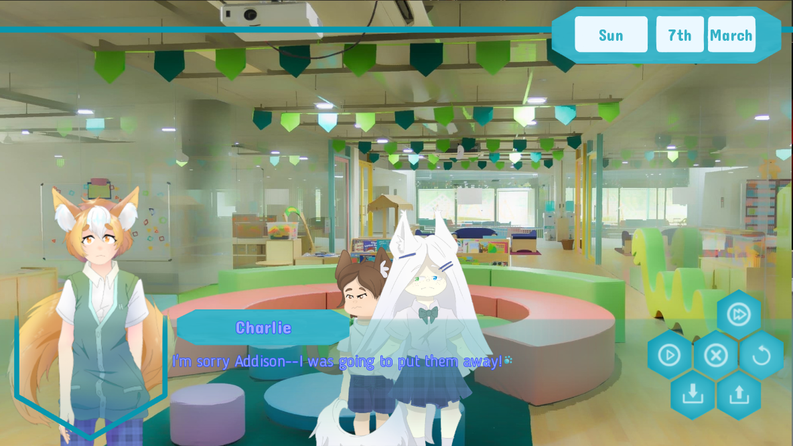

# HelixFelix

* protopyte for main menu
* prototype for quick menu
* prototype for calendar screen
* solved problem with variables points
* add new layers (background and event)
* cards command
* Mini-game Draw
* Mini-game hide-seek
* POV system
## Calendar screen ##
when a day starts, you can use:
   
* calendar day 0
* calendar next
* calendar manual "Monday" "23rd" "March"
* calendar add "Monday" "23rd" "July"

Example: 

    label day0:
    "bla bla"
    #calendar day <day_number>
    calendar day 0 #set day 
    ...
    ...

    label day1:
    "bla bla"
    #calendar next
    calendar next # day+1
    ...
    ...
        
    label day1:
    "bla bla"
    #calendar manual <string1> <string2> <string3>
    calendar manual "Monday" "23rd" "March" # day="Monday 23rd March"
    ...
    ...

## Menu Example ##

    menu:
    "Dr. Moore" if (steven_points>=-4 and steven_points<=5) or debug_test:
      "Of course, because he gave me all these wonderful supplies in the first place. He's been so kind, even though he started out shy."
      $ steven_points += 2
      $ giftsteven = True
      jump giftmaking
    "Dr. Kronauer" if (lukas_points>=-1 and lukas_points<=4) or debug_test:
      "Dr. Kroanuer has been busy lately, and he needs something to cheer him up."
      $ lukas_points += 2
      $ giftlukas = True
      jump giftmaking
    "Pumpkin"if (pumpkin_points>=-1 and pumpkin_points<=2) or debug_test:
      "Pumpkin has been going through so many changes, and he's moving into his new room. Maybe a picture would be a good way to start decorating. I can't make it like his secret room with just one picture, but I can try my best."
      $ pumpkin_points += 2
      $ giftpumpkin = True
      jump giftmaking

## Cards fun facts ##

    ######################################
    # cards open  duration 10sec 
    # with dissolve
    ######################################
    cards open card7

## Hide and Seek minigame ##

    $ minigame_hs=Hide_seek(5)
    $ minigame_hs.InitGame("bg playroom2", 0.0, (0, 408), "hs1",(285,408),"hs2",(603,508),"hs3",(1166,616),"hs4",(1602,740),"hs5")
    $ minigame_hs.GameAsBG()
    window hide
    $ minigame_hs.StartGame()
    $ minigame_hs.GameAsBG()
    hide screen hs_minigame with dissolve
    jump hs_end

be careful with the labels "hs_diag**X**" do not delete the "return"

    label hs_diag0:
     ...
     ...
     return
    label hs_diag1:
     ...
     ...
     return
## Draw mini-game ##

    ######################################
    #Launch minigame_draw
    ######################################
    #minigame draw start <id_draw>
    minigame draw start 0
    ######################################
    #Show draw of minigame_draw    
    #id_draw 0,1,2,3,4,etc.. only numbers
    #xpos int value
    #ypos int value
    ######################################
    #minigame draw open <xpos> <ypos> <id_draw>
    minigame draw open 160 40 0
    ######################################    
    #hide draw of minigame_draw
    ######################################
    #minigame draw close
    minigame draw close
## POV system ##

If you want Addison to react without saying something, react to another character's line, or react during his monologue, the format is the same. Simply use the `pov attrs` command, followed by the sprite you want. Let's say Addison is sad:
`a sad "I am sad :("
"Now I am thinking sad thoughts."`
To cheer Addison up, we can just say `pov attrs happy`. Now the next line will show Addison as being happy, even if that line isn't Addison's dialogue!
`"Now I found some happy thoughts! Hooray!"`
Finally, we can change Addison's sprite like normal with dialogue afterwards.
`a excited "Let's go play!`

I've attached images to illustrate the code!
### Important:

At the beginning of day 0, you'll find this line:
`pov set a`
This sets `pov`, the point-of-view character, to Addison. Don't change this!

## Screenshot ##

